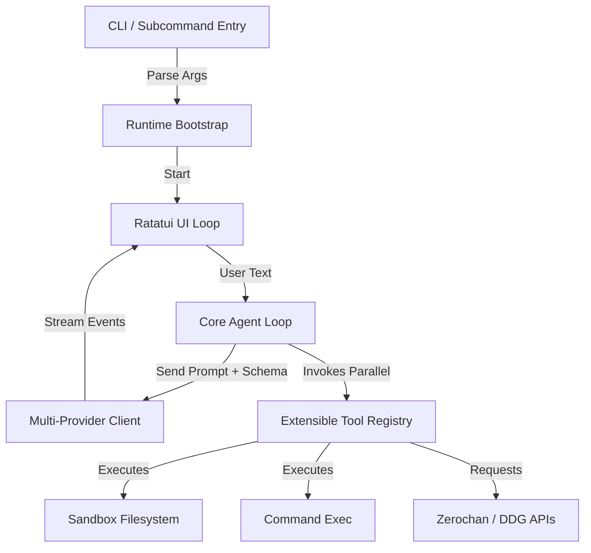

# Norvexum 🦀

[](LICENSE)
[](https://www.rust-lang.org)

Norvexum is a highly responsive, multi-threaded developer agent CLI and Terminal User Interface (TUI) built in Rust. It utilizes modern AI models (including Gemini, Claude, OpenAI, and AICredits.in) to autonomously solve coding tasks, read and edit files, execute shell commands, perform secure package safety scans, and search web assets—all safely sandboxed within the project workspace.

## 📺 Norvexum in Action: Auto-Generating Its Own Docs

https://github.com/user-attachments/assets/581b20f0-c470-4fec-a776-037bc2ea070a

---

## 🗺️ Architecture Overview

The system is decoupled into core layers communicating via standard asynchronous channels:



---

## 🚀 Key Features

### ⚡ Parallel Tool Execution
Norvexum is designed for speed. If the AI requests multiple tool calls (e.g. reading three separate files and fetching a webpage), Norvexum executes them **concurrently** using `futures::join_all` and Tokio async wakers, rather than sequentially.

### 🛡️ Secure Workspace Sandbox
Enforces strict canonical path verification. The agent cannot read, edit, copy, or write to any file outside the workspace root directory. Any attempt to traverse directories (e.g., using `../../`) is immediately blocked and returned as a sandboxing error.

### 🌸 Dedicated Zerochan & DDG Clients
*   **`zerochan_search`**: A dedicated API tag client for high-quality anime, game, manga, and fictional character illustrations. Supports multi-tag queries using comma separations (e.g. `Genshin Impact, Furina`). It handles tag-specific redirections and preserves JSON API parameters.
*   **`image_search`**: Generic web image search utilizing DuckDuckGo.
*   **`batch_download_images`**: Concurrently downloads up to 20 images directly to your specified folder or current working directory.

### 📸 Vision & OCR Multimodality
*   **Multimodal Input**: Automatically parses user inputs for image paths (PNG, JPG, WebP), base64-encodes them, and attaches them to Gemini/Claude/OpenAI content streams.
*   **TUI Image Inspector**: Autonomous image viewing via the `view_image` tool.
*   **OCR Space Fallback**: For text-only language models, Norvexum automatically invokes an OCR API fallback to read visual text.

### 🛡️ Dependency Safety Shield
Before running dangerous setups or installing pip/npm packages, the **`check_package`** tool checks package names against the Open Source Vulnerabilities (OSV) database and runs typosquatting checks to prevent malicious dependency injection.

### 💾 Persistent State and Session Manager
Config values and provider choices are saved to `.norvexum/config.toml` so your setup carries over automatically. Active conversations are archived and can be restored seamlessly.

---

## 🛠️ Installation & Setup

### Prerequisites
Make sure you have Rust and Cargo installed:
*   [Rust Installation Guide](https://www.rust-lang.org/tools/install)

### Installation
1. Clone the repository:
   ```bash
   git clone https://github.com/Pratik-3706/Norvexum.git
   cd Norvexum
   ```
2. Build and install the binary globally to your Cargo path:
   ```bash
   cargo install --path . --force
   ```
   *This adds the `norvexum` command to your shell's global executable path.*

---

## 📖 CLI Command Reference

Norvexum supports subcommands and arguments for fine-tuned startup:

| Command | Action |
| :--- | :--- |
| `norvexum init` | Initialize environment and create workspace configuration template. |
| `norvexum chat` | Start interactive terminal chat/TUI (default). |
| `norvexum chat <message>` | Start interactive chat with an initial prompt. |
| `norvexum chat --headless` | Run chat in CLI/Stdout mode (no TUI). |
| `norvexum --model <id> --provider <name>` | Override default model/provider for the session. |
| `norvexum config list` | Show all active configuration settings. |
| `norvexum config set <key> <value>` | Update a specific configuration option. |

---

## ⚙️ Configuration Setup

1. Initialize the workspace:
   ```bash
   norvexum init
   ```
2. Open the generated `.env` file in the workspace directory and specify your API credentials:
   ```env
   AICREDITS_API_KEY=your_key_here
   GOOGLE_AI_API_KEY=your_key_here
   TAVILY_API_KEY=your_key_here
   OCR_SPACE_API_KEY=your_key_here
   ```

---

## 🛠️ Complete Tool List

The agent has access to a comprehensive suite of registered developer tools:

*   **Filesystem**: `read_file`, `write_file`, `edit_file`, `list_dir`, `grep_search`, `find_files`, `touch`, `remove_file`, `move_file`, `copy_file`, `pwd`.
*   **Web Operations**: `web_search` (Tavily search client), `web_fetch` (markdown scraper).
*   **Media**: `generate_image` (Gemini/Pollinations/DALL-E 3 unified generator), `image_search` (DDG), `zerochan_search` (Zerochan Tag API), `download_image`, `batch_download_images`, `view_image`.
*   **Execution**: `run_command` (shell task runner with TUI interactive turn approvals), `check_package` (OSV vulnerability protection shield).
*   **VCS**: `git_status`, `git_diff`, `git_commit`, `git_log`.

---

## ⚖️ License & Copyright

### Software
The codebase is licensed under the [MIT License](LICENSE).

### Assets Copyright (CRITICAL)
> [!IMPORTANT]
> All files, graphics, and animations located in the `assets/` directory (including `assets/cheap_logo.png` and contents of `assets/loading_animation/`) are **strictly copyrighted by the project author**.
>
> **You are NOT permitted to:**
> *   Sell or distribute these assets.
> *   Modify, alter, or adapt these assets in any way.
> *   Use these assets for any commercial purposes.
>
> Violation of these terms is subject to legal action under copyright infringement laws.
